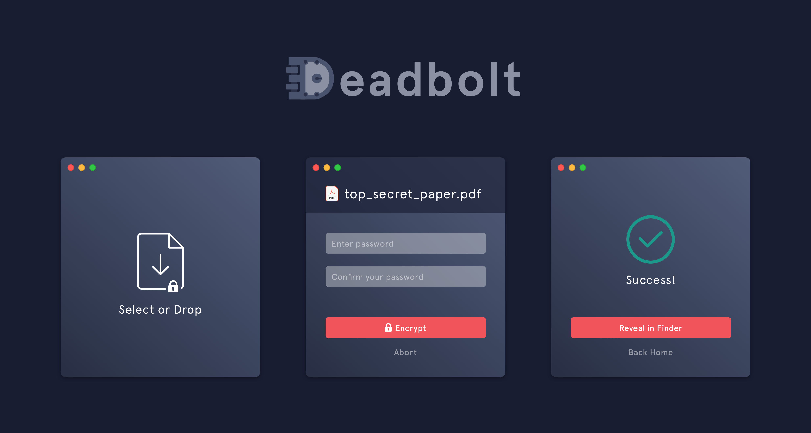

# deadbolt



`deadbolt` removes all the complication of encrypting and decrypting files. Select a file to encrypt, enter a password, and … that’s it. Decrypting the file is as simple as entering the password.

You can download `deadbolt` for **Mac OS**, **Windows**, or **Linux**. Any encrypted file can be shared across these platforms.

> Note: `deadbolt` can only encrypt files. To encrypt a directory, compress it into a .zip file before using `deadbolt`.

## Installation

If you're running **Mac OS**, install `deadbolt` with Homebrew:

```bash
$ brew cask install deadbolt
```

If you're running **Windows** or **Linux**, download the latest release [here.](https://github.com/alichtman/deadbolt/releases)

## How it Works

`deadbolt` is built on Electron and uses crypto.js from the node.js standard library. The encryption protocol used is AES-256-GCM. The derived key for the cipher is created using 10,000 iterations of pbkdf2Sync, taking in a 64B randomly generated salt, the user generated password, a 32B key length and SHA512 digest. The authenticity of the data is verified with the authentication tag provided by using GCM.

## FAQ

### Showing Extensions on `macOS`

By default, `macOS` hides file extensions. To reduce confusion about what type each file is, I recommend configuring `macOS` to show file extensions. You can do that with the following command: `$ defaults write NSGlobalDomain AppleShowAllExtensions -bool true && killall Finder`.

### Setting `deadbolt` as Default App for `.dbolt` Files on macOS

You can set this app as the default app for `.dbolt` files, which means you'll be able to double-click on `.dbolt` files to open them with `deadbolt` for decryption.

You can set this up the first time you double-click on a `.dbolt` file, or by right-clicking on a `.dbolt` file, selecting `Get Info` and changing the default app in the `Open With:` section.

To do this programmatically, run the following snippet:

```bash
$ brew install duti
$ duti -s org.alichtman.deadbolt dyn.ah62d4rv4ge80k2xtrv4a all
```

The output of `$ duti -x dbolt` should then be:

```bash
$ duti -x dbolt
Deadbolt.app
/Applications/Deadbolt.app
org.alichtman.deadbolt
```
