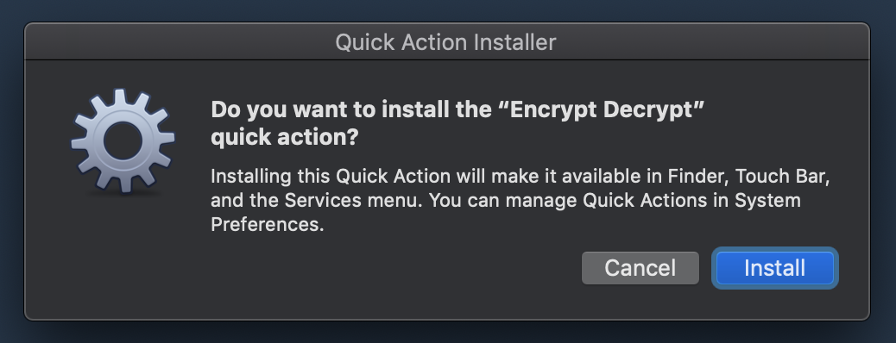
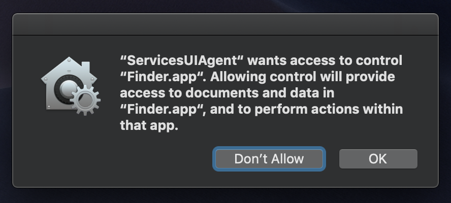
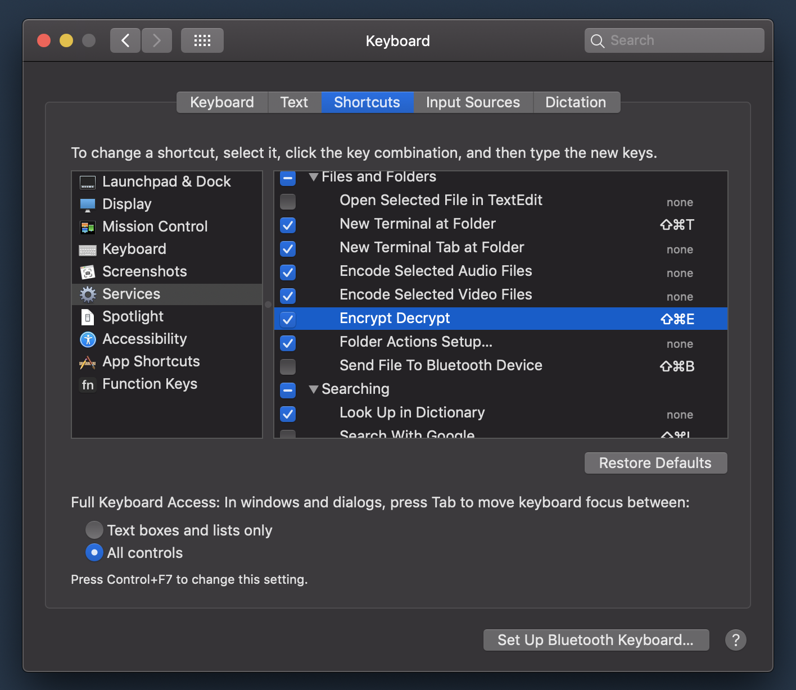

# macOS-encrypt-decrypt-quick-actions

This `macOS` `Quick Action` removes all the complication when encrypting and decrypting files. Simply right click on a file you'd like to encrypt or decrypt, select the `Encrypt Decrypt` `Quick Action`, and follow the prompts. To decrypt, double click on the file with the `.encrypted` extension.

<h1 align="center">
  
  <br />
</h1>

## Installation

```bash
$ git clone https://github.com/alichtman/macOS-encrypt-decrypt.git
$ cd macOS-encrypt-decrypt
$ ./install.sh
```

You will see a prompt like this. Click `Install`:

<h1 align="center">
  
  <br />
</h1>

After, you will see this prompt asking to allow a `Quick Action` to interact with files on your computer through Finder, which will let you to encrypt and decrypt files by right-clicking on them. Without this permission, nothing will work, so I'd recommend clicking `OK`.

<h1 align="center">
  
  <br />
</h1>

If you'd like to add a keyboard shortcut, go to `Preferences > Keyboard > Shortcuts > Services`.

<h1 align="center">
  
  <br />
</h1>

This script also installs the `Encrypt Decrypt.app`. You can set this app as the default app for `.encrypted` files, which means you'll be able to double-click on files with that extension and be prompted for a decryption password. You can set this up the first time you double-click on a `.encrypted` file, or by right-clicking on a `.encrypted` file, selecting `Get Info` and changing the default app in the `Open With:` section.

## Usage Notes

- This script can encrypt any file or directory. It uses `AES-256` in `CTR` mode.

- After files are encrypted, they will have an extension like `.aef99d86babcf82102fa.encrypted`. This extension holds a `SHA1` hash of the decrypted file which is used to verify the decryption password you enter is correct. If you alter this extension, decryption will fail because the file hashes won't match. You'll still be able to decrypt your file on the command line with `$ openssl enc -d -aes-256-ctr -in ENCRYPTED_FILE -out DECRYPTED_FILE`, though.

## Configuration

There are two options you can configure in the file `~/.encrypt-decrypt.plist`. This file is automatically created when you run the install script.

- `deleteEncryptedFileAfterDecryption`
	* **Default**: `False`. Set this to `True` if you'd like to automatically remove the encrypted versions of successfully decrypted files.
- `encryptedFileExtension`
	* **Default**: `.encrypted`. Change this if you'd like to change the default extension of encrypted files. If you decide to change this, note that all encrypted files will not decryt successfully unless their extensions are also modified.

## Technical Details

This script uses `openssl`'s implementation of the [`AES 256`](https://csrc.nist.gov/csrc/media/publications/fips/197/final/documents/fips-197.pdf) encryption algorithm in [Counter](https://en.wikipedia.org/wiki/Block_cipher_mode_of_operation#Counter_(CTR)) (`CTR`) mode, as is recommended in Professor Rogaway's [_Evaluation of Some Blockcipher Modes of Operation_](https://web.cs.ucdavis.edu/~rogaway/papers/modes.pdf). This algorithm is part of the NSA's [Commercial National Security Algorithm Suite](https://apps.nsa.gov/iaarchive/programs/iad-initiatives/cnsa-suite.cfm) and is approved to protect up to TOP SECRET documents.

This script uses the `openssl` `-salt`  option. This makes [Rainbow Table attacks](https://en.wikipedia.org/wiki/Rainbow_table) impractical, however, it also means that if you encrypt a file and forget the password -- that's game. Nobody can recover that file. Back up your passphrases!
