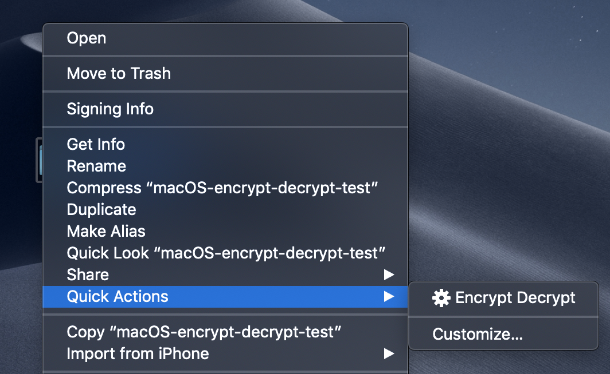

# macOS-encrypt-decrypt

This `macOS` `Quick Action` removes all the complication when encrypting and decrypting files. Simply right click on a file you'd like to encrypt or decrypt, select the `Encrypt Decrypt` `Quick Action`, and follow the prompts.

<h1 align="center">
  
  <br />
</h1>

## Installation

```bash
$ cd ~/Downloads
$ git clone https://github.com/alichtman/macOS-encrypt-decrypt.git
$ brew install openssl  # OpenSSL is a dependency of this Quick Action
# TODO: Script installation? https://apple.stackexchange.com/a/250299
```

## Usage Notes

- This script can encrypt any file or directory. It uses `AES-256` in `CTR` mode. It can also decrypt any file that was encrypted using `AES-256-CTR` mode.

- After files are encrypted, they will have the `.encrypted` extension. This extension is not used to determine filetype by the script. **WARNING: If you remove the file extension, decrypting the file will overwrite the encrypted file.**

## Technical Details

This script uses `openssl`'s implementation of the [`AES 256`](https://csrc.nist.gov/csrc/media/publications/fips/197/final/documents/fips-197.pdf) encryption algorithm in [Counter](https://en.wikipedia.org/wiki/Block_cipher_mode_of_operation#Counter_(CTR)) (`CTR`) mode, like is recommended in Professor Rogaway's [_Evaluation of Some Blockcipher Modes of Operation_](https://web.cs.ucdavis.edu/~rogaway/papers/modes.pdf). This algorithm is part of the NSA's [Commercial National Security Algorithm Suite](https://apps.nsa.gov/iaarchive/programs/iad-initiatives/cnsa-suite.cfm) and is approved to protect up to TOP SECRET documents.

This script uses the `-salt` `openssl` option. This makes [Rainbow Table attacks](https://en.wikipedia.org/wiki/Rainbow_table) impractical, however, it also means that if you encrypt a file and forget the password -- you're out of luck. Nobody can bend the laws of math to help you recover that file.
