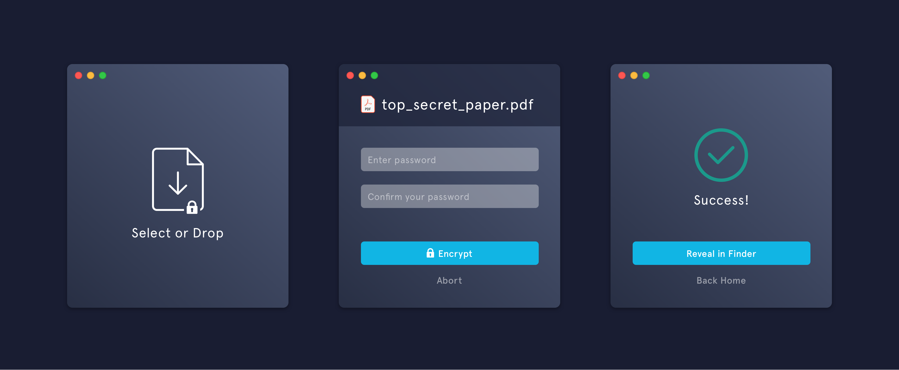

# deadbolt



`deadbolt` simplifies encrypting and decrypting files. All you need is a password.

Select a file (or folder) to encrypt, enter a password, and … that's it. Decryption is just as easy.

You can download `deadbolt` for **macOS**, **Windows**, or **Linux**. Any encrypted file can be shared across these platforms.

## Building / Installing

Check out the [releases tab](https://github.com/alichtman/deadbolt/releases) for pre-built binaries for Mac, Windows, and Linux.

### `macOS`

#### Recommended: Installing with Homebrew

The recommended way to install `deadbolt` on `macOS` is with [Homebrew](https://brew.sh), which uses [this recipe](https://github.com/Homebrew/homebrew-cask/blob/master/Casks/d/deadbolt.rb):

```bash
# Install Homebrew
$ /bin/bash -c "$(curl -fsSL https://raw.githubusercontent.com/Homebrew/install/HEAD/install.sh)"

# Install deadbolt, using homebrew
$ brew install deadbolt --cask
```

When you open the app, you'll receive a Gatekeeper warning about the app not being verified as malware-free.


This is because the app is not signed/notarized, since I do not have an Apple Developer account. You can bypass this warning by running:

```bash
$ xattr -c /Applications/Deadbolt.app
```

Or, go to `System Preferences > Security & Privacy > General` and click "Open Anyway".


#### Using `.dmg` from GitHub Releases

Install the `deadbolt.dmg` file from [GitHub Releases](https://github.com/alichtman/deadbolt/releases). There are builds for both `x86_64` (Intel) and `arm64` (Apple Silicon -- M1, M2, etc.) CPU architectures.

After downloading:

1. Double-click the `.dmg` file to mount it
2. Drag the `Deadbolt` app to your `Applications` folder
3. Unquarantine the app by running:

```bash
$ xattr -c /Applications/Deadbolt.app
```

### Windows

Download an `.exe` file, or installer, from [GitHub Releases](https://github.com/alichtman/deadbolt/releases).

### Linux

`AppImage` and `flatpak` packages are available for Linux. `AppImages` can run on all major Linux desktop distributions, and `flatpak` packages are provided as another option. Auto-updates are not supported for Linux currently.

<!-- TODO: Add reference to flathub once I get that published [Flathub](https://flathub.org/apps/details/org.alichtman.deadbolt)-->

#### Building and installing `flatpak` package from source

```bash
$ git clone https://github.com/alichtman/deadbolt.git && cd deadbolt

deadbolt on main is 📦 v2.0.0-beta via node v22.11.0 took 0s
$ npm install

deadbolt on main is 📦 v2.0.0-beta via node v22.11.0 took 0s
$ npm run package:linux-flatpak

deadbolt on main is 📦 v2.0.0-beta via node v22.11.0
$ ls -la release/build/
...
.rw-r--r--. alichtman alichtman  75 MB Sat Feb  8 21:42:00 2025 Deadbolt-2.0.0-beta.x86_64.flatpak

deadbolt on main is 📦 v2.0.0-beta via node v22.11.0 took 0s
$ flatpak install --user release/build/Deadbolt-2.0.0-beta.x86_64.flatpak

org.alichtman.deadbolt permissions:
    ipc   wayland   x11   dri   file access [1]

    [1] home


        ID                               Branch           Op           Remote                   Download
 1. [✓] org.alichtman.deadbolt           master           i            deadbolt-origin          0 bytes

Installation complete.

deadbolt on main is 📦 v2.0.0-beta via node v22.11.0 took 7s
$ flatpak run org.alichtman.deadbolt
```

#### Arch

`deadbolt` is [packaged as `deadbolt-bin` on `aur`](https://aur.archlinux.org/packages/deadbolt-bin). I do not maintain this package, so use at your own risk.

```bash
$ yay -S deadbolt-bin
```

## CLI Usage

`deadbolt` now includes a command-line interface for encrypting and decrypting files without the GUI.

### Installation

After installing the desktop app, you can use the CLI by building it from source:

```bash
$ git clone https://github.com/alichtman/deadbolt.git && cd deadbolt
$ npm install --ignore-scripts
$ npm run build:cli
```

Then you can run it with:

```bash
$ node dist/cli/cli/index.js [command]
```

Or install it globally with `npm link` to use the `deadbolt` command directly.

### Commands

#### Encrypt

Encrypt a file or folder with a password:

```bash
# Interactive mode (prompts for file, password, and output path)
$ deadbolt encrypt

# Command-line mode
$ deadbolt encrypt --file /path/to/file.txt --password mypassword

# With custom output path
$ deadbolt encrypt --file /path/to/file.txt --password mypassword --output /path/to/encrypted.deadbolt
```

**Options:**
- `-f, --file <path>` - Path to the file or folder to encrypt
- `-p, --password <password>` - Password for encryption
- `-o, --output <path>` - Output path for the encrypted file (optional)

**Encrypting folders:** When encrypting a folder, `deadbolt` automatically creates a zip archive before encryption.

#### Decrypt

Decrypt a `.deadbolt` or `.dbolt` file:

```bash
# Interactive mode (prompts for file, password, and output path)
$ deadbolt decrypt

# Command-line mode
$ deadbolt decrypt --file /path/to/file.deadbolt --password mypassword

# With custom output path
$ deadbolt decrypt --file /path/to/file.deadbolt --password mypassword --output /path/to/decrypted.txt
```

**Options:**
- `-f, --file <path>` - Path to the encrypted file
- `-p, --password <password>` - Password for decryption
- `-o, --output <path>` - Output path for the decrypted file (optional)

### Interactive Mode

Running `deadbolt encrypt` or `deadbolt decrypt` without any options will launch an interactive mode that prompts you for:
- File path
- Password (hidden input for security)
- Password confirmation (for encryption)
- Output path (optional)

### Examples

```bash
# Encrypt a file
$ deadbolt encrypt --file document.pdf --password "my-secure-password"
# Output: document.pdf.deadbolt

# Encrypt a folder
$ deadbolt encrypt --file ~/Documents/my-folder --password "my-secure-password"
# Output: ~/Documents/my-folder.zip.deadbolt

# Decrypt a file
$ deadbolt decrypt --file document.pdf.deadbolt --password "my-secure-password"
# Output: document.pdf

# Use interactive mode
$ deadbolt encrypt
🔐 Deadbolt - Interactive Encryption Mode

? Enter the path to the file or folder to encrypt: document.pdf
? Enter password: ****
? Confirm password: ****
? Enter output path (press Enter for default):

Encrypting...
Encryption successful!
Output: document.pdf.deadbolt
```

## How it Works

### Non-Technical Version

`deadbolt` uses a proven, secure encryption algorithm to make sure your files stay safe.

### Technical Version

`deadbolt` is built on Electron and uses `crypto.js` from the `node.js` standard library. The encryption protocol used is `AES-256-GCM`. This algorithm is part of the NSA's [Commercial National Security Algorithm Suite](https://apps.nsa.gov/iaarchive/programs/iad-initiatives/cnsa-suite.cfm) and is approved to protect up to TOP SECRET documents. A 256-bit derived key for the cipher is created using 11,000 iterations of `pbkdf2` with the `SHA-512 HMAC` digest algorithm, a 64-byte randomly generated salt, and a user generated password. The authenticity of the data is verified with the authentication tag provided by using GCM. These parameters were chosen by following the [NIST Guidelines for `pbkdf2`](https://nvlpubs.nist.gov/nistpubs/Legacy/SP/nistspecialpublication800-132.pdf).

## Security Review

The cryptography components of `deadbolt` were written by an ex-Facebook Security Engineer ([@alichtman](https://github.com/alichtman) -- me), and have been briefly reviewed by [Vlad Ionescu](https://github.com/vladionescu), an ex-Facebook tech lead from the Red Team / Offensive Security Group. Their review is:

> "yeah fuck it, it's fine. You're using very boring methods for everything -- that's the way to do it"

## FAQ

### Showing Extensions on `macOS`

By default, `macOS` hides file extensions. To reduce confusion about what type each file is, I recommend configuring `macOS` to show file extensions. You can do that with the following command: `$ defaults write NSGlobalDomain AppleShowAllExtensions -bool true && killall Finder`.

### Setting `deadbolt` as Default App for `.deadbolt` Files on macOS

You can set this app as the default app for `.deadbolt` files, which means you'll be able to double-click on `.deadbolt` files to open them with `deadbolt` for decryption.

You can set this up the first time you double-click on a `.deadbolt` file, or by right-clicking on a `.deadbolt` file, selecting `Get Info` and changing the default app in the `Open With:` section.

To do this programmatically, run the following snippet:

```bash
$ brew install duti
$ duti -s org.alichtman.deadbolt dyn.ah62d4rv4ge80k2xtrv4a all
```

The output of `$ duti -x deadbolt` should then be:

```bash
$ duti -x deadbolt
Deadbolt.app
/Applications/Deadbolt.app
org.alichtman.deadbolt
```
